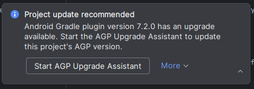
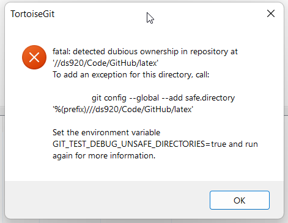

# Gradle and Git extras

## Gradle AGP upgrade
tldr; do not press this button to upgrade the AGP if it shows up.



More information can be found at [this Cookbook article](https://cookbook.dairy.foundation/gradle/dont_upgrade/dont_upgrade.html).

## "Dubious ownership" when trying to use Git
You may have some problems if Git reports dubious ownership over the BunyipsLib/BunyipsFTC project.

The error may have text like:



This can happen if the BunyipsFTC project is on another drive.
If you're on a club laptop, open `cmd` (Command Prompt) in Windows, and run:
```
git config --global --add safe.directory "*"
```
*note: this command should only be run on club laptops