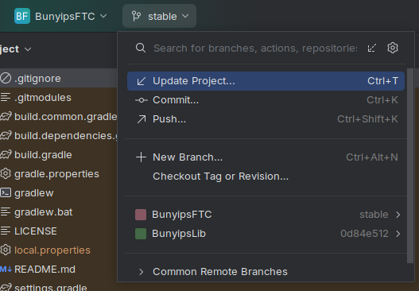
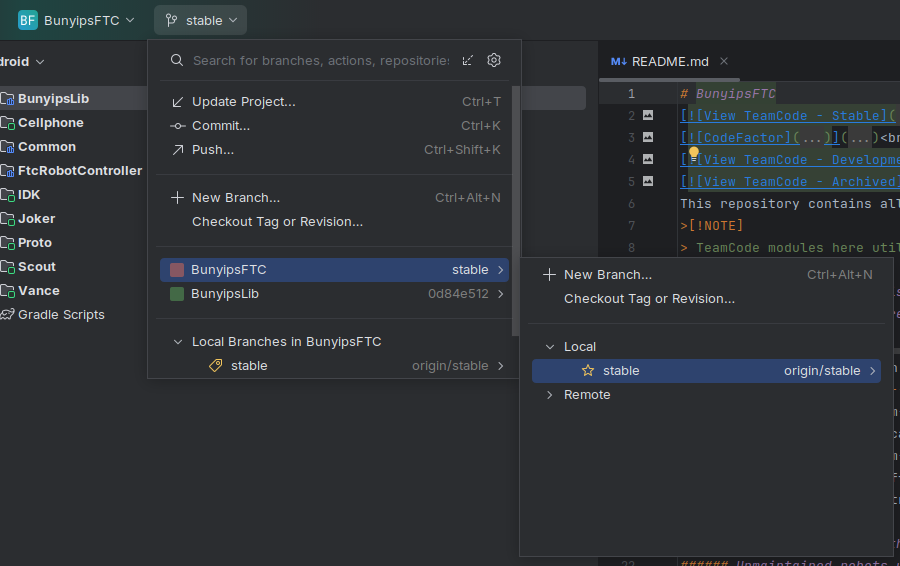
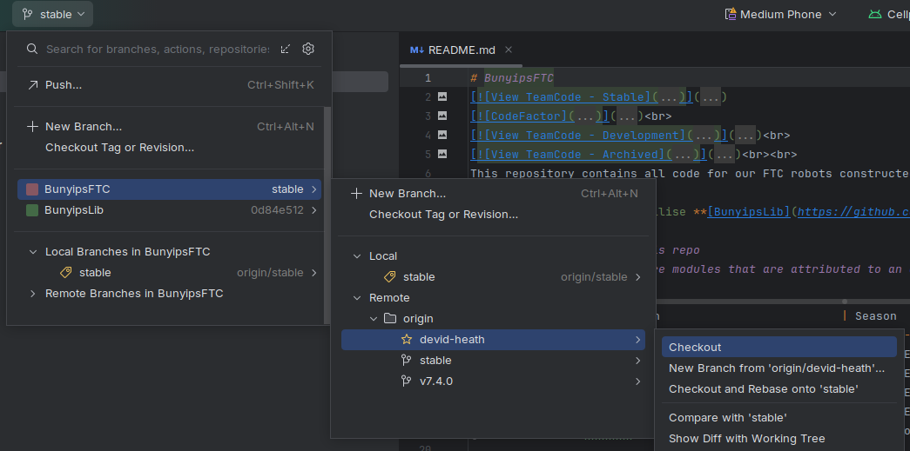
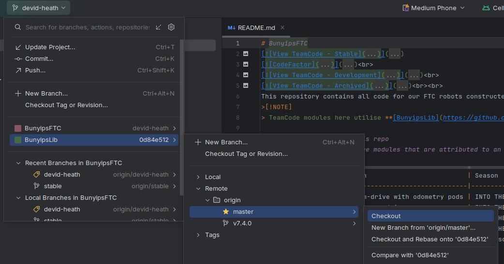
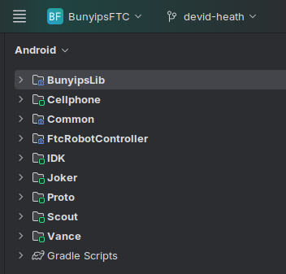

# Configuring Android Studio
Setting up Android Studio is usually a one-time process. Android Studio is the interface used between the code and robot.

[https://developer.android.com/studio](https://developer.android.com/studio)

You will need a GitHub account with access to the Murray-Bridge-Bunyips organisation (or to use the `MBHSRobotics` shared account).

## First-time setup
For new laptops, you will need to `Clone Repository` of URL: `https://github.com/Murray-Bridge-Bunyips/BunyipsFTC`.

Once the project is loaded, you must change the branch you are on. To do this, click `stable` in the top left:

Then, press `stable >`:

Open `Remote`, `origin`, `devid-heath` and click `Checkout`.

You are now on the development branch of BunyipsFTC.

## Configuring BunyipsLib
Before you proceed with programming, you will also need to change to the latest commit (master branch) of BunyipsLib.

Open the branch menu shown before, and this time click on `BunyipsLib`. Open `Remote`, `origin`, `master`, and click `Checkout`.

Your computer is now configured to use BunyipsFTC. These steps do not need to be repeated for this computer.

Once Gradle completes syncing (you can manually initialise a sync with Ctrl+Shift+O), the Android view on the left should display robot files.

