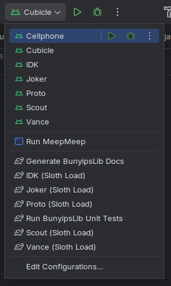
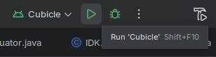

# Deploying your code

When it is time to deploy your code to the robot, connect to it via Wi-Fi or USB. Ensure to select the correct robot from the build menu:

Sloth Loads (if implemented) can be selected as well from this list.

**You should see "REV Robotics Control Hub" (or similar) to the left of the selector box.**

When it is time to deploy, press the green play button.

Full Gradle builds can take upwards of a few minutes, which is why Sloth Loads are beneficial.

And remember, *you can't press a button wrong.*
