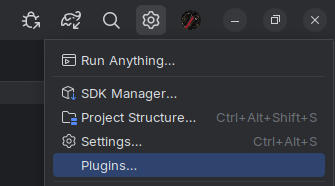

# Wirelessly connecting to the robot

In order to deploy code efficiently, it is important to be able to connect to the robot wirelessly.

While a cable will provide immediate connection, a helpful plugin called `ADB Wi-Fi` be installed to assist in connecting to the robot over the Wi-Fi.

> [!NOTE]
> Wireless connection to the robot also works when the REV Hardware Client is open. Installing the plugin is still required.

## Installing ADB Wi-Fi

To install, open the settings cog and click `Plugins`:

Go to the `Marketplace`, and search `ADB Wi-Fi`. Install the plugin by "Yuri Polek":

## Using ADB Wi-Fi
When connected to the robot's Wi-Fi network (e.g. `15215-RC-A`, `22407-RC`, `FTC-Qagb`) while the robot is on, you can access ADB Wi-Fi in the right panel:

Initially, there will be no devices in here. You can add a robot by connecting one over USB, then a green Connect button will appear. Once connected, USB can
be disconnected. You won't have to connect over USB in future occasions as it will remain in the menu.

Simply press Connect while the robot is on, and you are connected to the Wi-Fi. This process may happen automatically on connection.

## Debugging ADB Wi-Fi
Sometimes, pressing Connect does not work, and this is a common issue. There are a few ways to resolve this.
1. Reconnecting your Wi-Fi network
2. Restarting Android Studio
3. Restarting the robot by the power switch
4. Restarting REV Hardware Client (if used)

If none of these work, connect via USB again.
