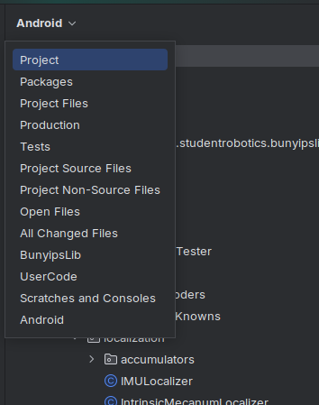
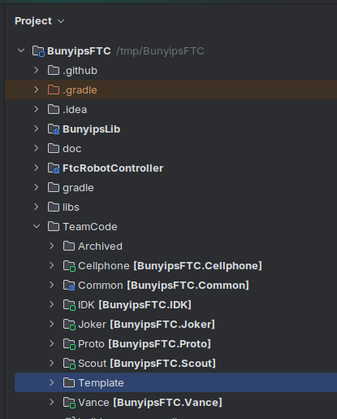
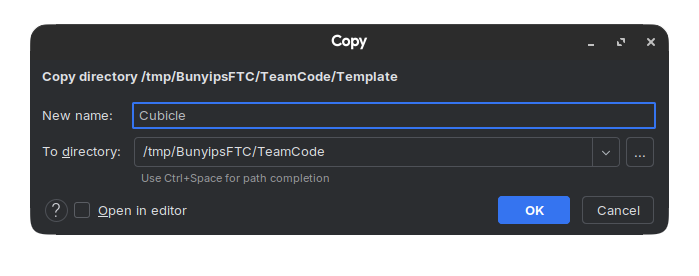
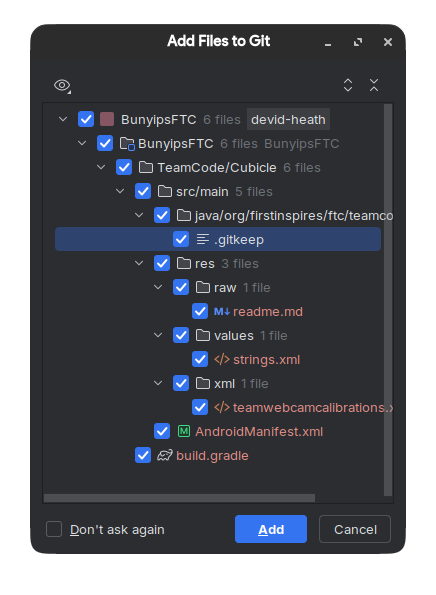
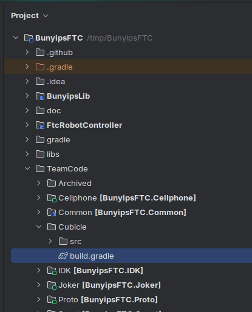
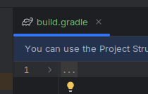
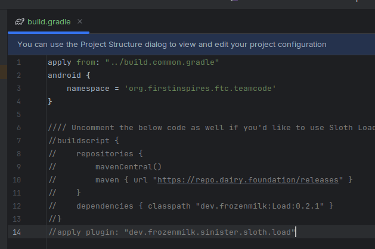
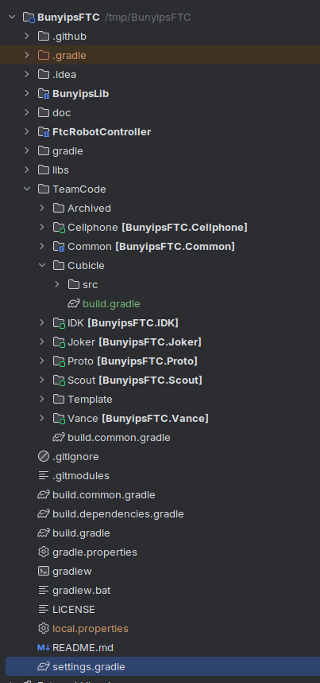
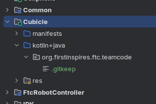

# Making a new robot

With access to the BunyipsFTC project complete, you are now able to access the software for all current robots.

If you would like to make a new robot, some configuration is required internally in the project.

These steps are also located in the "Common" directory within BunyipsFTC ([file](https://github.com/Murray-Bridge-Bunyips/BunyipsFTC/blob/63c052b95a4ebb2d6af2bf7e1e4e0ff03da7484e/TeamCode/Common/src/main/java/org/firstinspires/ftc/teamcode/common/README.md#making-a-new-robot)).

To create a new robot, you will need to think of a name for your new robot. Once you have one, switch
your filesystem view from `Android` to `Project`:



Open `BunyipsFTC > TeamCode` and find the `Template` directory:



Right-click to copy and paste it in `TeamCode`. Input the name of your robot here. This example will use the robot name `Cubicle`:



__Note: The "To Directory" field in the above screenshot may not match what you get, but it should end with `BunyipsFTC/TeamCode`.__

Add files to Git if you are prompted:



Open the new directory of your robot's name, and double-click to open the `build.gradle` file of your robot:




Expand the dots, then uncomment lines 1-4 inside this file:



> [!NOTE]
> You can optionally uncomment lines 6-14 to configure Sloth Load.
>
> Sloth Load allows you to "fast build" code during rapid testing. However, this is out of scope of this guide and setup is explained by [this BunyipsLib Wiki page](https://github.com/Murray-Bridge-Bunyips/BunyipsLib/wiki/Installation#using-sloth-load-fast-sdk-deployment). It is optional but recommended.

Finally, to complete setup, find the `settings.gradle` file in the root of the BunyipsFTC project (usually at the bottom), then open it:



At the bottom of this file, add these two lines, **ensuring to substitute the example name "Cubicle" with your robot's name**:

```java
include ':Cubicle'
project(":Cubicle").projectDir = new File("TeamCode/Cubicle")
```

Finally, press Ctrl+Shift+O which will sync Gradle and add your configuration to the list.

Return to Android view in the filesystem viewer. You should confirm that your robot appears in the Android view list now.

Inside your new robot directory under `kotlin+java`, a `.gitkeep` file should exist. This `.gitkeep` file can be deleted. This is the directory where all of your robot code will go.



Your robot is now ready to be programmed.