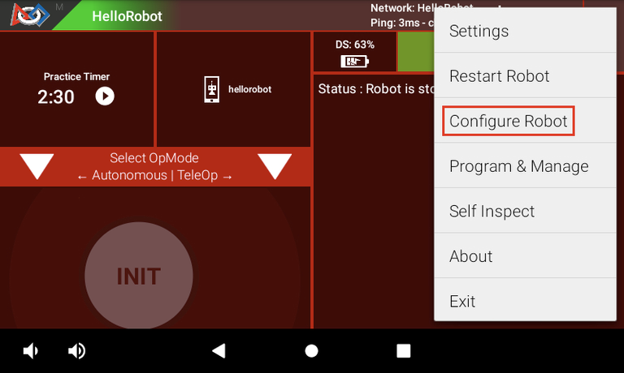
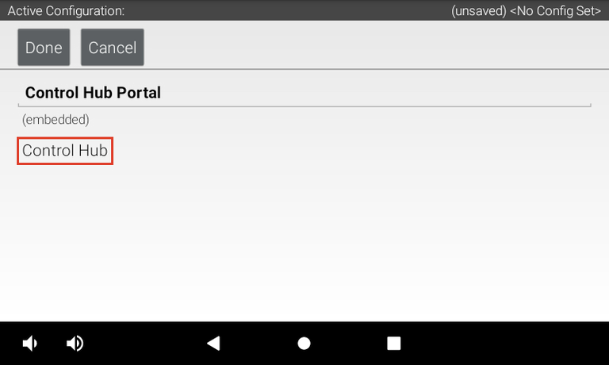
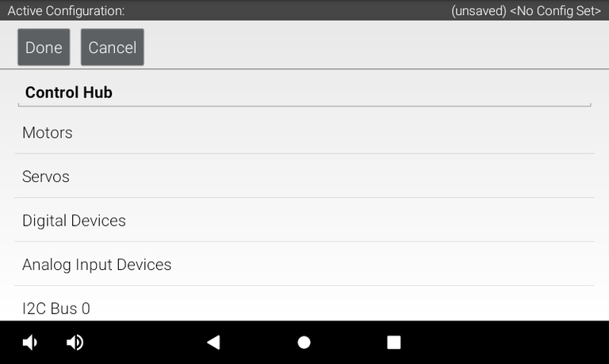
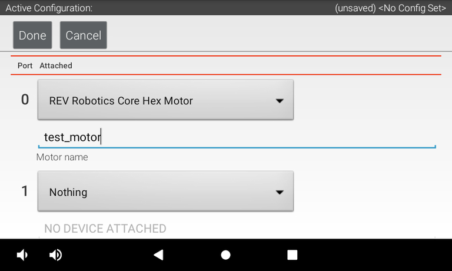
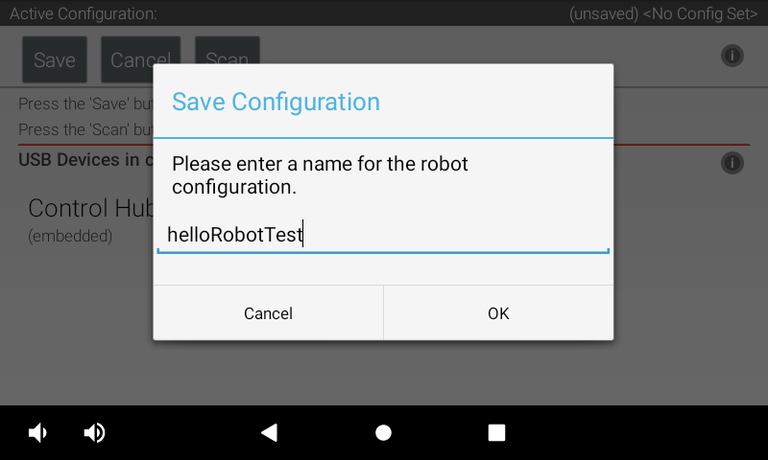

# Mapping robot hardware

While every REV Control Hub is the same, the robots being controlled are each unique. Each Control Hub has the same number of input and output ports for motors, sensors and cameras, but, how you may utilize these ports varies from system to system. For instance, a Color Sensor V3 may be plugged in to I2C Bus 1 on one person's Hub, but another might use the same bus to host a 2m Distance Sensor.

While the Control Hub may know there is a device attached to a port, it doesn't instinctively know which information needs to be transferred back for use in an OpMode. To help our robot out we need to complete a process called hardware mapping.

For us, this is a two-step process.

## Configure Robot on Driver Hub
These instructions follow the official REV "[Setting up a Configuration](https://docs.revrobotics.com/duo-control/hello-robot-blocks/configuration#configuring-common-hardware-devices)" resource.

1. Access the Configure Robot menu to start hardware mapping.

2. Create a New configuration for a new robot, or Edit an existing one.

3. Open "Control Hub Portal", then "Control Hub" or "Expansion Hub" to enter configuration.

4. For this particular hub, this is where you will map your motor ports to names. **Ensure to remember or write down these names.**

*Name your hardware devices according to what they do. A motor used to lift a linear slide can be called a "lift", and drivebase motors are usually named by their position "front_back", "bl", etc. A left and right claw can be called "left_claw" and "right_claw" etc.*

> [!TIP]
> USB cameras show up on the root screen with Control Hub Portal after pressing Scan. REV Robotics Touch Sensors (limit switches) are mapped on the N+1'th Digital Port.

5. Once you've configured all devices across your Control/Expansion Hub(s), you can Save the configuration.

The Control Hub will now store these hardware mappings and you can exit the hardware configuration.