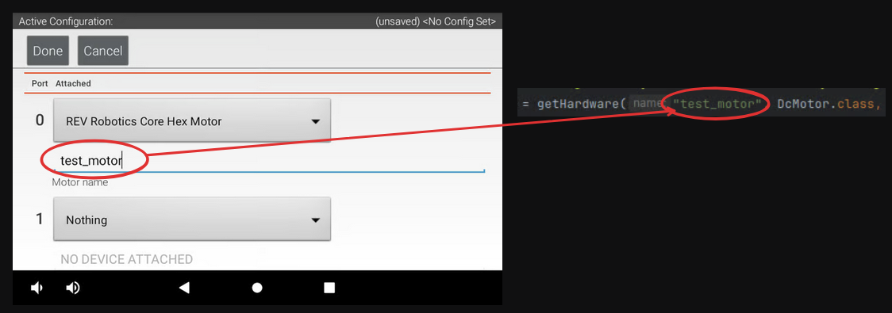

# Configuration file

With your robot configured by the hardware map, creating your main `RobotConfig` file is the next major step.

Your configuration file is the interface between all your OpModes and the hardware devices.

1. In the directory of your robot - where the previous `.gitkeep` file existed - right click, and create a `New > Java Class`.

> [!NOTE]
> This example will still use `Cubicle` as the robot name. Ensure to change this to your robot name selected previously.

2. Name this new Java Class the name of your robot:


3. Add File to Git if you are prompted.

4. With your main configuration file created, you can select a drivebase template to paste in below. If you'd like to be more manual with your configuration file,
[read the BunyipsLib Wiki page on robot configuration](https://github.com/Murray-Bridge-Bunyips/BunyipsLib/wiki/Robot-Configuration).

The configurations below are templates that you should copy and replace (Ctrl+A then Ctrl+V) and work from there.

**Ensure to change the name Cubicle to your robot's name.**

You may also want to use RoadRunner, which is used in Autonomous to create complex paths and to follow them.
To learn about RoadRunner and how to use it, [consult the BunyipsLib Wiki](https://github.com/Murray-Bridge-Bunyips/BunyipsLib/wiki/RoadRunner) and use the RoadRunner template. RoadRunner requires a lot more setup to use properly due to the tuning process.

___
## If you're using a Mecanum drive-

### -with RoadRunner
Copy the following as your configuration:
```java
package org.firstinspires.ftc.teamcode;

import com.qualcomm.hardware.rev.RevHubOrientationOnRobot;
import com.qualcomm.robotcore.hardware.DcMotor;
import com.qualcomm.robotcore.hardware.DcMotorSimple;
import com.qualcomm.robotcore.hardware.IMU;

import au.edu.sa.mbhs.studentrobotics.bunyipslib.RobotConfig;
import au.edu.sa.mbhs.studentrobotics.bunyipslib.hardware.IMUEx;
import au.edu.sa.mbhs.studentrobotics.bunyipslib.roadrunner.parameters.DriveModel;
import au.edu.sa.mbhs.studentrobotics.bunyipslib.roadrunner.parameters.MecanumGains;
import au.edu.sa.mbhs.studentrobotics.bunyipslib.roadrunner.parameters.MotionProfile;
import au.edu.sa.mbhs.studentrobotics.bunyipslib.subsystems.drive.MecanumDrive;

/**
 * Main robot configuration file.
 * Bootstrapped through bunyipslib-for-rookies.
 *
 * @author Your Name, Year // TODO: Set this to your name and the current year!
 */
public class Cubicle extends RobotConfig {
    public final Hardware hw = new Hardware();

    // ... SUBSYSTEMS AND OTHER PUBLIC DECLARATIONS HERE ...
    public MecanumDrive drive;
    // TODO: Add more subsystems here according to your robot's needs
    // .....................................................

    @Override
    protected void onRuntime() {
        // TODO: Change or confirm the hardware name "fl" is your Front Left Mecanum Motor
        hw.fl = getHardware("fl", DcMotor.class, (d) -> {
            // TODO: Set the direction of the front left motor here
            d.setDirection(DcMotorSimple.Direction.FORWARD);
        });

        // TODO: Change or confirm the hardware name "bl" is your Back Left Mecanum Motor
        hw.bl = getHardware("bl", DcMotor.class, (d) -> {
            // TODO: Set the direction of the back left motor here
            d.setDirection(DcMotorSimple.Direction.FORWARD);
        });

        // TODO: Change or confirm the hardware name "br" is your Back Right Mecanum Motor
        hw.br = getHardware("br", DcMotor.class, (d) -> {
            // TODO: Set the direction of the back right motor here
            d.setDirection(DcMotorSimple.Direction.FORWARD);
        });

        // TODO: Change or confirm the hardware name "fr" is your Front Right Mecanum Motor
        hw.fr = getHardware("fr", DcMotor.class, (d) -> {
            // TODO: Set the direction of the front right motor here
            d.setDirection(DcMotorSimple.Direction.FORWARD);
        });

        // TODO: Confirm an IMU exists on I2C Bus 0 called "imu" on the Control Hub
        hw.imu = getHardware("imu", IMUEx.class, (d) ->
                d.lazyInitialize(new IMU.Parameters(new RevHubOrientationOnRobot(
                        // TODO: This process follows the IMU initialisation and orientation setup. Follow instructions for direction
                        //     here: https://ftc-docs.firstinspires.org/en/latest/programming_resources/imu/imu.html#axes-definition
                        RevHubOrientationOnRobot.LogoFacingDirection.UP, // TODO: Check if FIRST logo is pointing upward relative to front
                        RevHubOrientationOnRobot.UsbFacingDirection.LEFT // TODO: Check if USB is pointing left relative to front
                ))));

        DriveModel driveModel = new DriveModel.Builder()
                // TODO: Fill out as necessary according to the RoadRunner Tuning section of the BunyipsLib Wiki
                .build();
        MotionProfile motionProfile = new MotionProfile.Builder()
                // TODO: Fill out as necessary according to the RoadRunner Tuning section of the BunyipsLib Wiki
                .build();
        MecanumGains mecanumGains = new MecanumGains.Builder()
                // TODO: Fill out as necessary according to the RoadRunner Tuning section of the BunyipsLib Wiki
                .build();
        drive = new MecanumDrive(driveModel, motionProfile, mecanumGains, hw.fl, hw.bl, hw.br, hw.fr, hw.imu)
                // TODO: Set Localizer/other parameters here (if required) according to the RoadRunner section of the BunyipsLib Wiki
                .withName("Drive");
    }

    /**
     * Contains all hardware objects used for the robot.
     */
    public static class Hardware {
        // TODO: Rewrite the comments above each hardware declaration to match your port and name configuration (e.g <Control/Expansion> <port>: <name in DS>)
        //   It is strongly recommended to do this as hardware mappings may erase themselves unexpectedly.
        /**
         * Internally mounted on Control Hub I2C 0
         */
        public IMU imu;
        /**
         * Control 0: fl
         */
        public DcMotor fl;
        /**
         * Control 1: bl
         */
        public DcMotor bl;
        /**
         * Control 2: br
         */
        public DcMotor br;
        /**
         * Control 3: fr
         */
        public DcMotor fr;
        // TODO: Add more hardware devices here according to your robot's configuration
    }
}

```

### -without RoadRunner
Copy the following as your configuration:
```java
package org.firstinspires.ftc.teamcode;

import com.qualcomm.robotcore.hardware.DcMotor;
import com.qualcomm.robotcore.hardware.DcMotorSimple;

import au.edu.sa.mbhs.studentrobotics.bunyipslib.RobotConfig;
import au.edu.sa.mbhs.studentrobotics.bunyipslib.subsystems.drive.SimpleMecanumDrive;

/**
 * Main robot configuration file.
 * Bootstrapped through bunyipslib-for-rookies.
 *
 * @author Your Name, Year // TODO: Set this to your name and the current year!
 */
public class Cubicle extends RobotConfig {
    public final Hardware hw = new Hardware();

    // ... SUBSYSTEMS AND OTHER PUBLIC DECLARATIONS HERE ...
    public SimpleMecanumDrive drive;
    // TODO: Add more subsystems here according to your robot's needs
    // .....................................................

    @Override
    protected void onRuntime() {
        // TODO: Change or confirm the hardware name "fl" is your Front Left Mecanum Motor
        hw.fl = getHardware("fl", DcMotor.class, (d) -> {
            // TODO: Set the direction of the front left motor here
            d.setDirection(DcMotorSimple.Direction.FORWARD);
        });

        // TODO: Change or confirm the hardware name "bl" is your Back Left Mecanum Motor
        hw.bl = getHardware("bl", DcMotor.class, (d) -> {
            // TODO: Set the direction of the back left motor here
            d.setDirection(DcMotorSimple.Direction.FORWARD);
        });

        // TODO: Change or confirm the hardware name "br" is your Back Right Mecanum Motor
        hw.br = getHardware("br", DcMotor.class, (d) -> {
            // TODO: Set the direction of the back right motor here
            d.setDirection(DcMotorSimple.Direction.FORWARD);
        });

        // TODO: Change or confirm the hardware name "fr" is your Front Right Mecanum Motor
        hw.fr = getHardware("fr", DcMotor.class, (d) -> {
            // TODO: Set the direction of the front right motor here
            d.setDirection(DcMotorSimple.Direction.FORWARD);
        });

        drive = new SimpleMecanumDrive(hw.fl, hw.bl, hw.br, hw.fr)
                .withName("Drive");
    }

    /**
     * Contains all hardware objects used for the robot.
     */
    public static class Hardware {
        // TODO: Rewrite the comments above each hardware declaration to match your port and name configuration (e.g <Control/Expansion> <port>: <name in DS>)
        //   It is strongly recommended to do this as hardware mappings may erase themselves unexpectedly.
        /**
         * Control 0: fl
         */
        public DcMotor fl;
        /**
         * Control 1: bl
         */
        public DcMotor bl;
        /**
         * Control 2: br
         */
        public DcMotor br;
        /**
         * Control 3: fr
         */
        public DcMotor fr;
        // TODO: Add more hardware devices here according to your robot's configuration
    }
}
```

## If you're using a Tank drive-

### -with RoadRunner
Copy the following as your configuration:
```java
package org.firstinspires.ftc.teamcode;

import com.qualcomm.hardware.rev.RevHubOrientationOnRobot;
import com.qualcomm.robotcore.hardware.DcMotor;
import com.qualcomm.robotcore.hardware.DcMotorSimple;
import com.qualcomm.robotcore.hardware.IMU;

import java.util.Collections;

import au.edu.sa.mbhs.studentrobotics.bunyipslib.RobotConfig;
import au.edu.sa.mbhs.studentrobotics.bunyipslib.hardware.IMUEx;
import au.edu.sa.mbhs.studentrobotics.bunyipslib.roadrunner.parameters.DriveModel;
import au.edu.sa.mbhs.studentrobotics.bunyipslib.roadrunner.parameters.MotionProfile;
import au.edu.sa.mbhs.studentrobotics.bunyipslib.roadrunner.parameters.TankGains;
import au.edu.sa.mbhs.studentrobotics.bunyipslib.subsystems.drive.TankDrive;

/**
 * Main robot configuration file.
 * Bootstrapped through bunyipslib-for-rookies.
 *
 * @author Your Name, Year // TODO: Set this to your name and the current year!
 */
public class Cubicle extends RobotConfig {
    public final Hardware hw = new Hardware();

    // ... SUBSYSTEMS AND OTHER PUBLIC DECLARATIONS HERE ...
    public TankDrive drive;
    // TODO: Add more subsystems here according to your robot's needs
    // .....................................................

    @Override
    protected void onRuntime() {
        // TODO: Change or confirm the hardware name "left" is your left tank drive motor
        hw.left = getHardware("left", DcMotor.class, (d) -> {
            // TODO: Set the direction of the left motor here
            d.setDirection(DcMotorSimple.Direction.FORWARD);
        });
        
        // TODO: Change or confirm the hardware name "right" is your right tank drive motor
        hw.right = getHardware("right", DcMotor.class, (d) -> {
            // TODO: Set the direction of the right motor here
            d.setDirection(DcMotorSimple.Direction.FORWARD);
        });

        // TODO: Confirm an IMU exists on I2C Bus 0 called "imu" on the Control Hub
        hw.imu = getHardware("imu", IMUEx.class, (d) ->
                d.lazyInitialize(new IMU.Parameters(new RevHubOrientationOnRobot(
                        // TODO: This process follows the IMU initialisation and orientation setup. Follow instructions for direction
                        //     here: https://ftc-docs.firstinspires.org/en/latest/programming_resources/imu/imu.html#axes-definition
                        RevHubOrientationOnRobot.LogoFacingDirection.UP, // TODO: Check if FIRST logo is pointing upward relative to front
                        RevHubOrientationOnRobot.UsbFacingDirection.LEFT // TODO: Check if USB is pointing left relative to front
                ))));

        // TODO: If you have more motors on the left and right sides of your robot, configure them here as well.
        //    This configuration works with one motor on each side.

        DriveModel driveModel = new DriveModel.Builder()
                // TODO: Fill out as necessary according to the RoadRunner Tuning section of the BunyipsLib Wiki
                .build();
        MotionProfile motionProfile = new MotionProfile.Builder()
                // TODO: Fill out as necessary according to the RoadRunner Tuning section of the BunyipsLib Wiki
                .build();
        TankGains tankGains = new TankGains.Builder()
                // TODO: Fill out as necessary according to the RoadRunner Tuning section of the BunyipsLib Wiki
                .build();
        // TODO: Pass an Arrays.asList() instead of singletonList() with all left and right motors if you have more than one each
        drive = new TankDrive(driveModel, motionProfile, tankGains, Collections.singletonList(hw.left), Collections.singletonList(hw.right), hw.imu)
                // TODO: Set Localizer/other parameters here (if required) according to the RoadRunner section of the BunyipsLib Wiki
                .withName("Drive");
    }

    /**
     * Contains all hardware objects used for the robot.
     */
    public static class Hardware {
        // TODO: Rewrite the comments above each hardware declaration to match your port and name configuration (e.g <Control/Expansion> <port>: <name in DS>)
        //   It is strongly recommended to do this as hardware mappings may erase themselves unexpectedly.
        /**
         * Internally mounted on Control Hub I2C 0
         */
        public IMU imu;
        /**
         * Expansion 0: left
         */
        public DcMotor left;
        /**
         * Expansion 1: right
         */
        public DcMotor right;
        // TODO: Add more hardware devices here according to your robot's configuration
    }
}

```

### -without RoadRunner
Copy the following as your configuration:
```java
package org.firstinspires.ftc.teamcode;

import com.qualcomm.robotcore.hardware.DcMotor;
import com.qualcomm.robotcore.hardware.DcMotorSimple;

import java.util.Collections;

import au.edu.sa.mbhs.studentrobotics.bunyipslib.RobotConfig;
import au.edu.sa.mbhs.studentrobotics.bunyipslib.subsystems.drive.SimpleTankDrive;

/**
 * Main robot configuration file.
 * Bootstrapped through bunyipslib-for-rookies.
 *
 * @author Your Name, Year // TODO: Set this to your name and the current year!
 */
public class Cubicle extends RobotConfig {
    public final Hardware hw = new Hardware();

    // ... SUBSYSTEMS AND OTHER PUBLIC DECLARATIONS HERE ...
    public SimpleTankDrive drive;
    // TODO: Add more subsystems here according to your robot's needs
    // .....................................................

    @Override
    protected void onRuntime() {
        // TODO: Change or confirm the hardware name "left" is your left tank drive motor
        hw.left = getHardware("left", DcMotor.class, (d) -> {
            // TODO: Set the direction of the left motor here
            d.setDirection(DcMotorSimple.Direction.FORWARD);
        });

        // TODO: Change or confirm the hardware name "right" is your right tank drive motor
        hw.right = getHardware("right", DcMotor.class, (d) -> {
            // TODO: Set the direction of the right motor here
            d.setDirection(DcMotorSimple.Direction.FORWARD);
        });

        // TODO: If you have more motors on the left and right sides of your robot, configure them here as well.
        //    This configuration works with one motor on each side.

        // TODO: Pass an Arrays.asList() instead of singletonList() with all left and right motors if you have more than one each
        drive = new SimpleTankDrive(Collections.singletonList(hw.left), Collections.singletonList(hw.right))
                .withName("Drive");
    }

    /**
     * Contains all hardware objects used for the robot.
     */
    public static class Hardware {
        // TODO: Rewrite the comments above each hardware declaration to match your port and name configuration (e.g <Control/Expansion> <port>: <name in DS>)
        //   It is strongly recommended to do this as hardware mappings may erase themselves unexpectedly.
        /**
         * Expansion 0: left
         */
        public DcMotor left;
        /**
         * Expansion 1: right
         */
        public DcMotor right;
        // TODO: Add more hardware devices here according to your robot's configuration
    }
}

```
___

5. The provided templates are compiled with a set of yellow `TODO` messages to guide you in configuring the template.
6. While configuring, you will need to map the hardware names from the Driver Station to within the code. These mappings are the first parameter to `getHardware`.

> [!CAUTION]
> The name you enter for a particular device into Configure Robot must be the name entered as the corresponding device in the configuration file!
> 

You now have a basic hardware configuration for your drivetrain. We will add onto this configuration file to add other hardware components, such as lifts and claws.