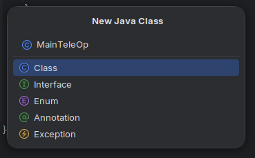

# Writing an iterative TeleOp

With all of your hardware tediously configured, it's time to write an OpMode to control this hardware.

The scope of this guide will demonstrate a basic iterative TeleOp for a robot configured with a `HoldableActuator` vertical lift, `MecanumDrive` drivebase, and `DualServos` claw.

> [!IMPORTANT]
> Autonomous operation and advanced TeleOp composition is only available in the task-based paradigm.
>
> An iterative TeleOp is fast and simple but advanced development of such an OpMode is ill-advised.
> The BunyipsLib wiki describes [Tasks](https://github.com/Murray-Bridge-Bunyips/BunyipsLib/wiki/Paradigms#tasks), [Scheduling](https://github.com/Murray-Bridge-Bunyips/BunyipsLib/wiki/Paradigms#scheduling), and [Command-based](https://github.com/Murray-Bridge-Bunyips/BunyipsLib/wiki/Creating-OpModes#command-based-teleop) in such cases.

## TeleOp template
In the directory of your robot, right click, and create a `New > Java Class`. This will be your main TeleOp class.



Remove all contents of this file and paste in the below template, **ensuring to replace "Cubicle" with your robot name**:
```java
package org.firstinspires.ftc.teamcode;

import com.qualcomm.robotcore.eventloop.opmode.TeleOp;

import au.edu.sa.mbhs.studentrobotics.bunyipslib.BunyipsOpMode;
import au.edu.sa.mbhs.studentrobotics.bunyipslib.BunyipsSubsystem;

/**
 * Primary TeleOp.
 * Bootstrapped through bunyipslib-for-rookies.
 *
 * @author Your Name, Year // TODO: Set this to your name and the current year!
 */
@TeleOp(name = "TeleOp")
public class MainTeleOp extends BunyipsOpMode {
    private final Cubicle robot = new Cubicle();

    @Override
    protected void onInit() {
        robot.init();
        // TODO: Add any additional initialisation code here

    }

    @Override
    protected void activeLoop() {
        // TODO: Add your active looping code here

        BunyipsSubsystem.updateAll();
    }
}
```

Since all of the tedious configuration is abstracted into the configuration class, OpModes are simple to construct.
The basic units of work within a `BunyipsOpMode` are the two methods, `onInit()`, and `activeLoop()`.

`onInit()` is fired exactly once when the INIT button is pressed.

`activeLoop()` is called repeatedly (up to 200 times/sec) after the PLAY button has been pressed, until the OpMode is stopped.

The generic initialiser, `robot.init()` handles calling the `onRuntime()` method as defined in your `RobotConfig`, as well as checking
for hardware map name mismatches.

The static method `BunyipsSubsystem.updateAll()` batch dispatches all hardware changes by calling `.update()` on every subsystem constructed at initialisation.
Without this method, you would have to call `.update()` on all of your subsystems (e.g. `drive.update()`, `lift.update()`).

## Adding functionality
This OpMode will appear on the Driver Station under the name "TeleOp" under the TeleOp list after you have deployed your code. However, it won't do anything meaningful
at the moment.

The job of the TeleOp is to take Gamepad input from both gamepads and command the exposed subsystems you defined in your configuration file.

> [!WARNING]
> The Y axis on sticks are inverted, meaning that pushing them fully upwards will return -1. This is an intended SDK feature. The output of `left_stick_y` and `right_stick_y` should be negated if you're expecting them to be opposite.

Some examples are provided for commanding common components in a TeleOp.

> [!TIP]
> This phase is when you should talk to your drivers about what controls they want!

### Commanding a Mecanum drive
The standard Mecanum controls is the left stick is used for translation and the right stick is used for rotation.

It is assumed this control is on `gamepad1`.

Inside the `activeLoop()`, add:
```java
double forward = -gamepad1.left_stick_y;
double strafe = -gamepad1.left_stick_x;
double rotation = -gamepad1.right_stick_x;
robot.drive.setPower(Geometry.vel(forward, strafe, rotation));
```

### Commanding a lift
The standard lift controls is that an analog stick is used to power the motor in either direction, with idle being stationary.

It is assumed this control is on `gamepad2`.

Inside the `activeLoop()`, add:
```java
robot.lift.setPower(-gamepad2.left_stick_y); // TODO: Select an appropriate stick
```

### Commanding opening and closing claws
The standard claw controls is that a button is used to open the claws, and a button is used to close the claws.

It is assumed this control is on `gamepad2`.

Inside the `activeLoop()`, add:
```java
// TODO: Select appropriate buttons (currently A and B, but can be any button on the controller)
//     You can also choose whether you only want to adjust one claw.
if (gamepad2.a) {
    claw.open(DualServos.ServoSide.BOTH);
}

if (gamepad2.b) {
    claw.close(DualServos.ServoSide.BOTH);
}
```

#### Optional toggles and rising edge detection
Sometimes, it is desired to instead *toggle* the state of the claws. However, naively calling
`claw.toggle()` presents an issue. Since the `activeLoop()` runs so quickly, pressing the button will
toggle the claw several hundred times a second, instead of firing only once.

This does not matter for methods that only set one state, but since a toggle mutates state, it will be toggled repeatedly.

A rising edge detector is built into the gamepads, which fires only on the "rising edge" of the gamepad signal.
Inside the `activeLoop()`, to toggle the claws use:
```java
// TODO: Select appropriate button (currently X)
if (gamepad2.getDebounced(Controls.X)) {
    claw.toggle(DualServos.ServoSide.BOTH);
}
```
___
Congratulations! At this point in the guide, you have now constructed a functional RobotConfig and simple TeleOp using BunyipsLib.

Further steps involve closely reading the BunyipsLib [API](http://bunyipslib.api.bubner.me/) and [Wiki](https://bunyipslib.wiki.bubner.me/) documentation, particularly around command-based, Autonomous, and advanced subsystem interaction.