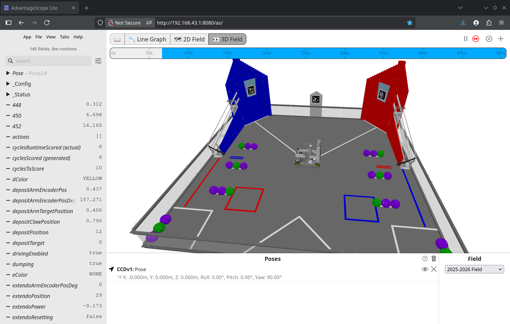

# AdvantageScope Lite quickstart

The BunyipsFTC project is equipped with [AdvantageScope Lite](https://github.com/j5155/AdvantageScope-Lite-FTC), a web dashboard similar to FtcDashboard
that provides robot diagnostics, log analysis and data visualisation tools.

> [!NOTE]
> AdvantageScope does not rely on BunyipsLib! It works seamlessly with the logs produced through RoadRunner's log system.

AdvantageScope is a tool that will be generally available to all FTC teams after the 2027 control systems merge, but an early port has been made to
support current FTC robots.

> [!IMPORTANT]
> Before using AdvantageScope, it is important to first know the capabilities of the FtcDashboard first. AdvantageScope is very similar in nature to FtcDashboard but
> provides greater emphasis on log recall and data visualisation. AdvantageScope can be too advanced for what you need.
>
> Review the [FtcDashboard section of the BunyipsLib wiki](https://github.com/Murray-Bridge-Bunyips/BunyipsLib/wiki/IO#ftcdashboard) before proceeding.

## Accessing AdvantageScope
While connected to the robot, navigate to [**http://192.168.43.1:8080/as**](http://192.168.43.1:8080/as) for a Control Hub.

The web interface will automatically connect to the FtcDashboard socket and provide data through AdvantageScope.

Telemetry attached to an FtcDashboard `TelemetryPacket` or through the BunyipsLib `DualTelemetry` object will display on the live view.

## Uploading the field overlay
By default, the field overlay for the current season is not uploaded to the robot. You will need to upload the asset files to the robot.
This process only has to be done once.

From **AdvantageScope-Lite-FTC**:

*Custom assets may be uploaded as zip files through the File → Upload Asset button. Zip files can contain any folder structure, multiple assets, and even other zip files. You can download premade assets from [https://github.com/Mechanical-Advantage/AdvantageScopeAssets/releases](https://github.com/Mechanical-Advantage/AdvantageScopeAssets/releases).*

The files you will need to upload to access the current FTC fields in 2D and 3D are in the **AllAssetsDefaultFTC.zip** bundle.

**You can download it [here](https://github.com/Mechanical-Advantage/AdvantageScopeAssets/releases/download/bundles-v1/AllAssetsDefaultFTC.zip).**

Uploading other assets can include CAD models of your robot which can be learnt about further in the [official AdvantageScope docs](https://docs.advantagescope.org/).

## Visualising the robot
With the correct assets, you can start the `2D Field` or `3D Field` and select the season field in the bottom right. To visualise your robot, you will need valid localisation.

This is covered in the [RoadRunner section of the BunyipsLib wiki](https://github.com/Murray-Bridge-Bunyips/BunyipsLib/wiki/RoadRunner).

To visualise the position of the robot live, simply drag the "pose Pose" `Pose2d` object into the Poses area on AdvantageScope with a field selected.

(Example image from the [AdvantageScope-Lite-FTC README](https://github.com/j5155/AdvantageScope-Lite-FTC/blob/main/FTCLite_Example.png))

## Recording information to logs
The RoadRunner `FlightRecorder` is used to record information to a log file. This log file can be read back and visualised later through AdvantageScope.

> [!NOTE]
> Reading logs back also works with AdvantageScope for desktop! However, this quickstart will use the web version on an active robot as accessing the log files is streamlined and automatic.

BunyipsLib also provides a utility to "observe" certain components, using `Dashboard.observe(...)`. This will ensure the components provided are regularly sent to
the `FlightRecorder`.

This is the recommended way to log the status of a particular subsystem, where all that is required is to call `observe` once for your subsystems on initialisation. Review the BunyipsLib API docs for the `Dashboard.observe` method for more details.

Several channels of information, including current pose data, are automatically sent to the `FlightRecorder` internally through the RoadRunner drive instances.

## Replaying logs
To replay a log, you can find ones on the robot Under File -> Open Logs.

> [!WARNING]
> The timestamp on the logs is dependent on the system clock on the Control Hub, which may be in the past, future, or completely inaccurate!

Data recorded by the `FlightRecorder` will appear on the replay.

## Further use
AdvantageScope Lite is new software, and the [official docs](https://docs.advantagescope.org/) can provide good information on what you can use AdvantageScope for.

Thanks to j5155 for providing the [j5155/AdvantageScope-Lite-FTC](https://github.com/j5155/AdvantageScope-Lite-FTC) project!